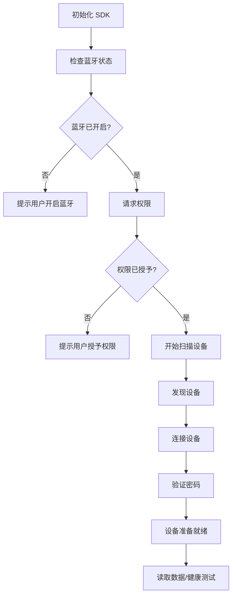
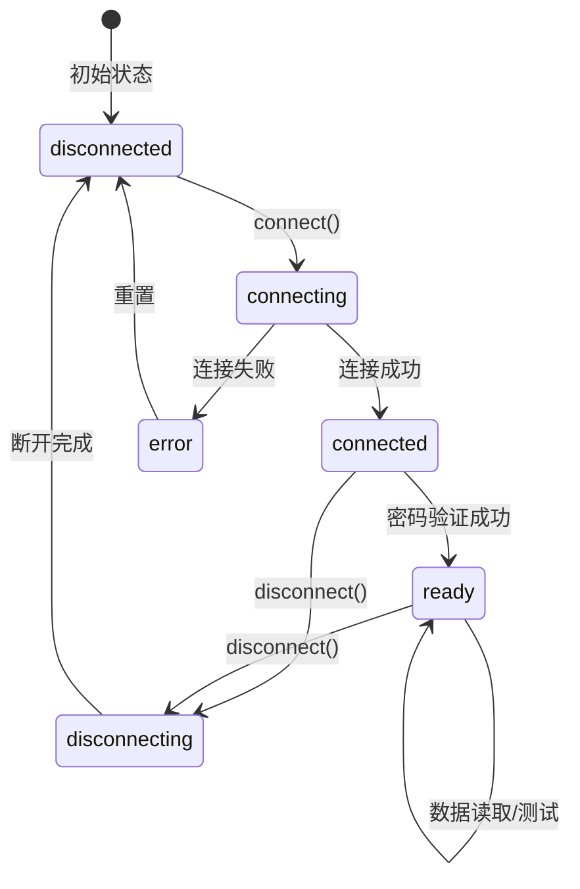
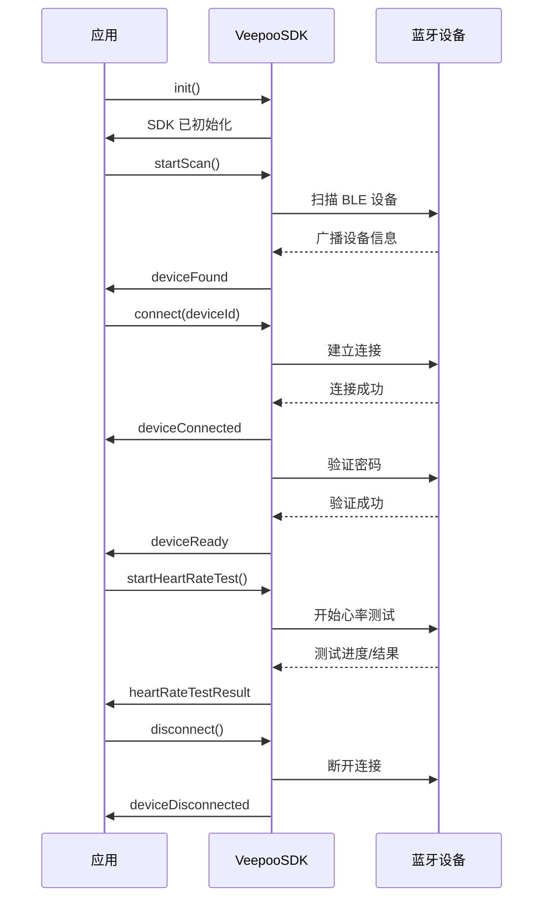

# @gaozh1024/expo-veepoo-sdk

[](https://badge.fury.io/js/@gaozh1024%2Fexpo-veepoo-sdk)
[](https://opensource.org/licenses/MIT)
[](https://github.com/gaozh1024/expo-veepoo-sdk)

Expo 模块，用于 Veepoo 设备蓝牙连接和数据交互。封装了 Veepoo 原生 SDK，提供统一的 TypeScript API。

## 特性

- 完整的蓝牙 LE 功能支持
- 跨平台支持（iOS 和 Android）
- TypeScript 类型完整
- 事件驱动架构
- 健康数据读取（心率、血压、血氧、体温、压力、血糖等）
- 睡眠和运动数据同步
- 实时健康测试

## 支持的健康数据

| 数据类型 | 说明 |
|---------|------|
| 心率 | 实时心率测量和历史数据 |
| 血压 | 收缩压、舒张压、脉搏 |
| 血氧 | 血氧饱和度 (SpO2) |
| 体温 | 体表/体温测量 |
| 压力 | 压力指数 (0-100) |
| 血糖 | 血糖值 (mmol/L) |
| 睡眠 | 深睡、浅睡、REM、清醒时长 |
| 运动 | 步数、距离、卡路里 |

---

## 目录

- [安装](#安装)
- [平台要求](#平台要求)
- [配置](#配置)
  - [iOS 配置](#ios-配置)
  - [Android 配置](#android-配置)
- [快速开始](#快速开始)
- [架构概览](#架构概览)
- [API 文档](#api-文档)
  - [初始化与状态](#初始化与状态)
  - [扫描与连接](#扫描与连接)
  - [设备信息](#设备信息)
  - [数据同步](#数据同步)
  - [健康测试](#健康测试)
  - [事件监听](#事件监听)
- [事件参考](#事件参考)
- [类型定义](#类型定义)
- [React Hook 集成](#react-hook-集成)
- [最佳实践](#最佳实践)
- [故障排除](#故障排除)
- [FAQ](#faq)
- [本地开发](#本地开发)
- [贡献指南](#贡献指南)
- [许可证](#许可证)
- [支持与致谢](#支持与致谢)

---

## 安装

```bash
npm install @gaozh1024/expo-veepoo-sdk
# 或
yarn add @gaozh1024/expo-veepoo-sdk
```

---

## 平台要求

| 平台 | 最低版本 | Expo Go 支持 | 备注 |
|------|----------|-------------|------|
| iOS | 15.1+ | ❌ 不支持 | 需要开发构建 |
| Android | 6.0+ (API 23+) | ❌ 不支持 | 需要开发构建 |

> **重要提示**: iOS 端由于包含原生 frameworks，必须在开发构建中使用，不支持 Expo Go。

---

## 配置

### iOS 配置

在 `app.json` 或 `app.config.js` 中添加蓝牙权限：

```json
{
  "expo": {
    "plugins": [
      [
        "@gaozh1024/expo-veepoo-sdk",
        {
          "bluetoothAlwaysPermission": "需要蓝牙权限来连接设备",
          "bluetoothPeripheralPermission": "需要蓝牙权限来扫描设备"
        }
      ]
    ]
  }
}
```

然后运行预构建：

```bash
npx expo prebuild --clean
cd ios && pod install && cd ..
npx expo run:ios
```

**iOS 注意事项：**
- ⚠️ 本模块包含原生 frameworks，**不能在 Expo Go 中使用**
- 必须使用开发构建
- 首次安装后需要重新编译

### Android 配置

Android 端权限已自动配置，无需额外操作。

模块会自动请求以下权限：
- `BLUETOOTH` / `BLUETOOTH_ADMIN`
- `BLUETOOTH_CONNECT` / `BLUETOOTH_SCAN` (Android 12+)
- `ACCESS_FINE_LOCATION` / `ACCESS_COARSE_LOCATION` (BLE 扫描需要)
- `POST_NOTIFICATIONS` (Android 13+)

**Android 注意事项：**
- ⚠️ 本模块包含原生代码，**不能在 Expo Go 中使用**
- ✅ 所有权限自动配置
- ⚠️ Android 12+ 需要在运行时请求蓝牙权限

---

## 快速开始

```typescript
import VeepooSDK from '@gaozh1024/expo-veepoo-sdk';

// 1. 初始化 SDK
await VeepooSDK.init();

// 2. 检查蓝牙状态
const isEnabled = await VeepooSDK.checkBluetoothStatus();
if (!isEnabled) {
  console.log('请开启蓝牙');
  return;
}

// 3. 请求权限
const permission = await VeepooSDK.requestPermissions();
if (!permission.granted) {
  console.log('请授予蓝牙权限');
  return;
}

// 4. 监听设备发现事件
VeepooSDK.on('deviceFound', (result) => {
  console.log('发现设备:', result.device);
});

// 5. 开始扫描
await VeepooSDK.startScan({ timeout: 10000 });

// 6. 连接设备
await VeepooSDK.connect(deviceId, { password: '0000' });

// 7. 监听连接状态
VeepooSDK.on('deviceConnected', (payload) => {
  console.log('设备已连接:', payload.deviceId);
});

VeepooSDK.on('deviceReady', (payload) => {
  console.log('设备准备就绪:', payload.deviceId);
  // 设备准备就绪后可以进行数据读取和健康测试
});

// 8. 读取电量
const battery = await VeepooSDK.readBattery();
console.log('电量:', battery.level);

// 9. 开始心率测试
await VeepooSDK.startHeartRateTest();

VeepooSDK.on('heartRateTestResult', (payload) => {
  if (payload.result.state === 'over') {
    console.log('心率:', payload.result.value);
  }
});
```

---

## 架构概览

### SDK 工作流程



### 连接状态机



### 事件流



---

## API 文档

### 初始化与状态

#### init()

初始化 SDK。必须在使用其他 API 之前调用。

**返回值:** `Promise<void>`

**示例:**
```typescript
await VeepooSDK.init();
console.log('SDK 初始化完成');
```

---

#### checkBluetoothStatus()

检查蓝牙是否已启用。

**返回值:** `Promise<PermissionsResult>`

**示例:**
```typescript
const isEnabled = await VeepooSDK.checkBluetoothStatus();
if (!isEnabled) {
  alert('请开启蓝牙');
}
```

---

#### requestPermissions()

请求蓝牙和位置权限。

**返回值:** `Promise<PermissionsResult>`

**示例:**
```typescript
const permission = await VeepooSDK.requestPermissions();
if (!permission.granted) {
  alert('请授予蓝牙权限');
}
```

---

#### isSDKInitialized()

检查 SDK 是否已初始化。

**返回值:** `boolean`

**示例:**
```typescript
if (VeepooSDK.isSDKInitialized()) {
  console.log('SDK 已初始化');
}
```

---

#### isScanningActive()

检查是否正在扫描设备。

**返回值:** `boolean`

**示例:**
```typescript
if (VeepooSDK.isScanningActive()) {
  console.log('正在扫描中...');
}
```

---

#### getConnectedDeviceId()

获取当前已连接设备的 ID。

**返回值:** `string | null`

**示例:**
```typescript
const deviceId = VeepooSDK.getConnectedDeviceId();
if (deviceId) {
  console.log('已连接设备:', deviceId);
}
```

---

### 扫描与连接

#### startScan(options?)

开始扫描 BLE 设备。

**参数:**
```typescript
interface ScanOptions {
  timeout?: number;         // 扫描超时时间（毫秒），默认：10000
  allowDuplicates?: boolean; // 是否允许重复设备，默认：false
}
```

**返回值:** `Promise<void>`

**示例:**
```typescript
// 监听设备发现事件
VeepooSDK.on('deviceFound', (result) => {
  console.log('发现设备:', result.device.name, result.device.rssi);
});

// 开始扫描，10秒超时
await VeepooSDK.startScan({ timeout: 10000 });
```

---

#### stopScan()

停止扫描设备。

**返回值:** `Promise<void>`

**示例:**
```typescript
await VeepooSDK.stopScan();
console.log('扫描已停止');
```

---

#### connect(deviceId, options?)

连接到指定设备。

**参数:**
- `deviceId` (string) - 设备 ID
- `options` (ConnectOptions, 可选) - 连接选项

```typescript
interface ConnectOptions {
  password?: string;      // 连接密码，默认：'0000'
  is24Hour?: boolean;     // 是否使用24小时制，默认：false
  timeSetting?: DeviceTimeSetting; // 时间设置
  uuid?: string;          // 设备 UUID（iOS）
}
```

**返回值:** `Promise<void>`

**示例:**
```typescript
// 连接设备
await VeepooSDK.connect(deviceId, {
  password: '0000',
  is24Hour: true,
});

// 监听连接成功
VeepooSDK.on('deviceConnected', (payload) => {
  console.log('设备已连接:', payload.deviceId);
});

// 监听设备准备就绪
VeepooSDK.on('deviceReady', (payload) => {
  console.log('设备准备就绪，可以开始操作');
});
```

---

#### disconnect(deviceId?)

断开与设备的连接。

**参数:**
- `deviceId` (string, 可选) - 设备 ID，不传则断开当前连接的设备

**返回值:** `Promise<void>`

**示例:**
```typescript
// 断开当前设备
await VeepooSDK.disconnect();

// 断开指定设备
await VeepooSDK.disconnect(deviceId);
```

---

#### getConnectionStatus(deviceId?)

获取设备连接状态。

**参数:**
- `deviceId` (string, 可选) - 设备 ID

**返回值:** `Promise<ConnectionStatus>`

**可能的值:**
- `'disconnected'` - 未连接
- `'connecting'` - 连接中
- `'connected'` - 已连接
- `'disconnecting'` - 断开连接中
- `'ready'` - 准备就绪
- `'error'` - 错误

**示例:**
```typescript
const status = await VeepooSDK.getConnectionStatus();
console.log('连接状态:', status);

if (status === 'ready') {
  // 可以进行数据读取和健康测试
}
```

---

### 设备信息

#### verifyPassword(password?, is24Hour?)

验证设备密码并获取设备信息。

**参数:**
- `password` (string, 可选) - 密码，默认：'0000'
- `is24Hour` (boolean, 可选) - 是否24小时制，默认：false

**返回值:** `Promise<PasswordData>`

**示例:**
```typescript
const passwordData = await VeepooSDK.verifyPassword('0000', true);
console.log('密码验证状态:', passwordData.status);
console.log('设备型号:', passwordData.deviceNumber);
console.log('固件版本:', passwordData.deviceVersion);
```

---

#### readBattery()

读取设备电量信息。

**返回值:** `Promise<BatteryInfo>`

**示例:**
```typescript
const battery = await VeepooSDK.readBattery();
console.log('电量:', battery.level);
console.log('是否低电量:', battery.isLowBattery);
console.log('充电状态:', battery.chargeState);
```

---

#### readDeviceFunctions()

读取设备支持的功能列表。

**返回值:** `Promise<DeviceFunctions>`

**示例:**
```typescript
const functions = await VeepooSDK.readDeviceFunctions();
console.log('心率功能:', functions.package1?.heartRateDetect);
console.log('血压功能:', functions.package1?.bloodPressure);
console.log('血氧功能:', functions.package1?.spoH);
```

---

#### readDeviceVersion()

读取设备版本信息。

**返回值:** `Promise<DeviceVersion>`

**示例:**
```typescript
const version = await VeepooSDK.readDeviceVersion();
console.log('硬件版本:', version.hardwareVersion);
console.log('固件版本:', version.firmwareVersion);
console.log('设备型号:', version.deviceNumber);
```

---

#### readSocialMsgData()

读取设备支持的社交消息功能。

**返回值:** `Promise<SocialMsgData>`

**示例:**
```typescript
const socialMsg = await VeepooSDK.readSocialMsgData();
console.log('微信:', socialMsg.wechat);
console.log('QQ:', socialMsg.qq);
console.log('短信:', socialMsg.sms);
```

---

#### syncPersonalInfo(info)

同步个人信息到设备（用于计算卡路里等）。

**参数:**
```typescript
interface PersonalInfo {
  sex: 0 | 1;        // 性别：0=女，1=男
  height: number;    // 身高（cm）
  weight: number;    // 体重（kg）
  age: number;       // 年龄
  stepAim: number;   // 步数目标
  sleepAim: number;  // 睡眠目标（分钟）
}
```

**返回值:** `Promise<boolean>`

**示例:**
```typescript
const success = await VeepooSDK.syncPersonalInfo({
  sex: 1,
  height: 175,
  weight: 70,
  age: 30,
  stepAim: 10000,
  sleepAim: 480,
});
```

---

#### setLanguage(language)

设置设备语言。

**参数:**
- `language` (Language) - 语言代码

**返回值:** `Promise<boolean>`

**支持的语言:**
```typescript
type Language =
  | 'chinese' | 'chineseTraditional' | 'english' | 'japanese' | 'korean'
  | 'german' | 'russian' | 'spanish' | 'italian' | 'french'
  | 'vietnamese' | 'portuguese' | 'thai' | 'polish' | 'swedish'
  | 'turkish' | 'dutch' | 'czech' | 'arabic' | 'hungarian'
  | 'greek' | 'romanian' | 'slovak' | 'indonesian' | 'brazilianPortuguese'
  | 'croatian' | 'lithuanian' | 'ukrainian' | 'hindi' | 'hebrew'
  | 'danish' | 'persian' | 'finnish' | 'malay';
```

**示例:**
```typescript
await VeepooSDK.setLanguage('chinese');
```

---

### 数据同步

#### startReadOriginData()

开始读取设备历史原始数据。

**返回值:** `Promise<void>`

**事件:**
- `readOriginProgress` - 读取进度
- `readOriginComplete` - 读取完成
- `originHalfHourData` - 半小时数据

**示例:**
```typescript
// 监听读取进度
VeepooSDK.on('readOriginProgress', (payload) => {
  console.log(`读取进度: ${payload.progress.progress * 100}%`);
});

// 监听半小时数据
VeepooSDK.on('originHalfHourData', (payload) => {
  console.log('半小时数据:', payload.data);
});

// 监听读取完成
VeepooSDK.on('readOriginComplete', (payload) => {
  console.log('读取完成:', payload.success);
});

// 开始读取
await VeepooSDK.startReadOriginData();
```

---

#### readDeviceAllData()

读取设备所有数据。

**返回值:** `Promise<boolean>`

**示例:**
```typescript
const success = await VeepooSDK.readDeviceAllData();
if (success) {
  console.log('数据读取成功');
}
```

---

#### readSleepData(date?)

读取睡眠数据。

**参数:**
- `date` (string, 可选) - 日期字符串，格式：'YYYY-MM-DD'

**返回值:** `Promise<SleepData[]>`

**示例:**
```typescript
// 读取今天的睡眠数据
const sleepData = await VeepooSDK.readSleepData();

// 读取指定日期的睡眠数据
const sleepData = await VeepooSDK.readSleepData('2024-01-15');

sleepData.forEach((day) => {
  console.log(`日期: ${day.date}`);
  day.items.forEach((item) => {
    console.log(`  深睡: ${item.deepSleepMinutes}分钟`);
    console.log(`  浅睡: ${item.lightSleepMinutes}分钟`);
    console.log(`  睡眠质量: ${item.sleepQuality}%`);
  });
});
```

---

#### readSportStepData(date?)

读取运动步数数据。

**参数:**
- `date` (string, 可选) - 日期字符串

**返回值:** `Promise<SportStepData>`

**示例:**
```typescript
const sportData = await VeepooSDK.readSportStepData();
console.log('步数:', sportData.stepCount);
console.log('距离:', sportData.distance);
console.log('卡路里:', sportData.calories);
```

---

#### readOriginData(dayOffset?)

读取原始数据。

**参数:**
- `dayOffset` (number, 可选) - 天数偏移量，0=今天，默认：0

**返回值:** `Promise<OriginData[]>`

**示例:**
```typescript
// 读取今天的原始数据
const originData = await VeepooSDK.readOriginData(0);

originData.forEach((data) => {
  console.log(`时间: ${data.time}`);
  console.log(`心率: ${data.heartValue}`);
  console.log(`步数: ${data.stepValue}`);
  console.log(`卡路里: ${data.calValue}`);
});
```

---

#### readDaySummaryData(dayOffset?)

读取按天聚合的汇总数据（30分钟粒度），包含运动、心率、血压列表。

**参数:**
- `dayOffset` (number, 可选) - 天数偏移量，0=今天，默认：0

**返回值:** `Promise<DaySummaryData>`

```typescript
interface DaySummaryData {
  date: string;              // 日期 "yyyy-MM-dd"
  allStep: number;           // 总步数
  sportList: Array<{         // 运动列表
    time: string;            // 时间 "HH:mm"
    step: number;            // 步数
    cal: number;             // 卡路里
    dis: number;             // 距离（米）
  }>;
  rateList: Array<{          // 心率列表
    time: string;            // 时间 "HH:mm"
    rate: number;            // 心率值
  }>;
  bpList: Array<{            // 血压列表
    time: string;            // 时间 "HH:mm"
    high: number;            // 收缩压（高压）
    low: number;             // 舒张压（低压）
  }>;
}
```

**示例:**
```typescript
// 读取今天的汇总数据
const dayData = await VeepooSDK.readDaySummaryData(0);

console.log('日期:', dayData.date);
console.log('总步数:', dayData.allStep);

// 遍历运动列表（每30分钟一条）
dayData.sportList.forEach((item) => {
  console.log(`${item.time} - 步数:${item.step}, 卡路里:${item.cal}, 距离:${item.dis}米`);
});

// 遍历心率列表
dayData.rateList.forEach((item) => {
  console.log(`${item.time} - 心率:${item.rate}`);
});

// 遍历血压列表
dayData.bpList.forEach((item) => {
  console.log(`${item.time} - 血压:${item.high}/${item.low}`);
});

// 读取昨天的数据
const yesterdayData = await VeepooSDK.readDaySummaryData(1);
```

---

#### readAutoMeasureSetting()

读取自动测量设置。

**返回值:** `Promise<AutoMeasureSetting[]>`

**示例:**
```typescript
const settings = await VeepooSDK.readAutoMeasureSetting();
settings.forEach((setting) => {
  console.log(`类型: ${setting.type}`);
  console.log(`启用: ${setting.enabled}`);
  console.log(`时间: ${setting.startTime} - ${setting.endTime}`);
});
```

---

#### modifyAutoMeasureSetting(setting)

修改自动测量设置。

**参数:**
```typescript
interface AutoMeasureSetting {
  type: string;        // 测量类型
  enabled: boolean;    // 是否启用
  startTime?: string;  // 开始时间 'HH:mm'
  endTime?: string;    // 结束时间 'HH:mm'
  interval?: number;   // 间隔（分钟）
}
```

**返回值:** `Promise<void>`

**示例:**
```typescript
await VeepooSDK.modifyAutoMeasureSetting({
  type: 'heartRate',
  enabled: true,
  startTime: '08:00',
  endTime: '22:00',
  interval: 30,
});
```

---

### 健康测试

#### startHeartRateTest()

开始心率测试。

**返回值:** `Promise<void>`

**事件:** `heartRateTestResult`

> **注意**: 由于 Veepoo SDK 不返回心率测试进度，本模块模拟了进度（25秒完成，每秒4%）。到达100%或出现错误状态时会自动停止测试。

**示例:**
```typescript
await VeepooSDK.startHeartRateTest();

VeepooSDK.on('heartRateTestResult', (payload) => {
  console.log('状态:', payload.result.state);
  console.log('进度:', payload.result.progress);
  
  if (payload.result.state === 'over') {
    console.log('心率:', payload.result.value, 'bpm');
  }
});
```

---

#### stopHeartRateTest()

停止心率测试。

**返回值:** `Promise<void>`

---

#### startBloodPressureTest()

开始血压测试。

**返回值:** `Promise<void>`

**事件:** `bloodPressureTestResult`

**示例:**
```typescript
await VeepooSDK.startBloodPressureTest();

VeepooSDK.on('bloodPressureTestResult', (payload) => {
  if (payload.result.state === 'over') {
    console.log('收缩压:', payload.result.systolic, 'mmHg');
    console.log('舒张压:', payload.result.diastolic, 'mmHg');
    console.log('脉搏:', payload.result.pulse, 'bpm');
  }
});
```

---

#### stopBloodPressureTest()

停止血压测试。

**返回值:** `Promise<void>`

---

#### startBloodOxygenTest()

开始血氧测试。

**返回值:** `Promise<void>`

**事件:** `bloodOxygenTestResult`

> **注意**: 由于 Veepoo SDK 不返回血氧测试进度，本模块模拟了进度（25秒完成，每秒4%）。到达100%或出现错误状态时会自动停止测试。

**示例:**
```typescript
await VeepooSDK.startBloodOxygenTest();

VeepooSDK.on('bloodOxygenTestResult', (payload) => {
  console.log('状态:', payload.result.state);
  console.log('进度:', payload.result.progress);
  
  if (payload.result.state === 'over') {
    console.log('血氧:', payload.result.value, '%');
    console.log('心率:', payload.result.rate, 'bpm');
  }
});
```

---

#### stopBloodOxygenTest()

停止血氧测试。

**返回值:** `Promise<void>`

---

#### startTemperatureTest()

开始体温测试。

**返回值:** `Promise<void>`

**事件:** `temperatureTestResult`

**示例:**
```typescript
await VeepooSDK.startTemperatureTest();

VeepooSDK.on('temperatureTestResult', (payload) => {
  if (payload.result.state === 'over') {
    console.log('体温:', payload.result.value, '℃');
  }
});
```

---

#### stopTemperatureTest()

停止体温测试。

**返回值:** `Promise<void>`

---

#### startStressTest()

开始压力测试。

**返回值:** `Promise<void>`

**事件:** `stressData`

**示例:**
```typescript
await VeepooSDK.startStressTest();

VeepooSDK.on('stressData', (payload) => {
  console.log('压力值:', payload.data.stress);
  console.log('是否完成:', payload.data.isEnd);
});
```

---

#### stopStressTest()

停止压力测试。

**返回值:** `Promise<void>`

---

#### startBloodGlucoseTest()

开始血糖测试。

**返回值:** `Promise<void>`

**事件:** `bloodGlucoseData`

**示例:**
```typescript
await VeepooSDK.startBloodGlucoseTest();

VeepooSDK.on('bloodGlucoseData', (payload) => {
  const { data } = payload;
  
  console.log('状态:', data.state);        // 'start' | 'testing' | 'over' | 'error'
  console.log('进度:', data.progress);     // 0-100
  console.log('是否结束:', data.isEnd);    // true/false
  
  if (data.state === 'over' || data.isEnd) {
    console.log('血糖值:', data.glucose, 'mmol/L');
    console.log('风险等级:', data.level);
  } else if (data.state === 'error') {
    console.log('测试失败:', data.error || data.status);
  } else {
    console.log('测试中... 进度:', data.progress, '%');
  }
});
```

---

#### stopBloodGlucoseTest()

停止血糖测试。

**返回值:** `Promise<void>`

---

### 事件监听

#### on(event, listener)

注册事件监听器。

**参数:**
- `event` (VeepooEvent) - 事件名称
- `listener` (function) - 事件处理函数

**返回值:** VeepooSDK 实例（支持链式调用）

**示例:**
```typescript
VeepooSDK.on('deviceFound', (payload) => {
  console.log('发现设备:', payload.device);
});
```

---

#### off(event, listener)

移除事件监听器。

**参数:**
- `event` (VeepooEvent) - 事件名称
- `listener` (function) - 要移除的监听器

**返回值:** VeepooSDK 实例

**示例:**
```typescript
const handler = (payload) => console.log(payload);
VeepooSDK.on('deviceFound', handler);
VeepooSDK.off('deviceFound', handler);
```

---

#### once(event, listener)

注册一次性监听器（触发一次后自动移除）。

**参数:**
- `event` (VeepooEvent) - 事件名称
- `listener` (function) - 事件处理函数

**返回值:** VeepooSDK 实例

**示例:**
```typescript
VeepooSDK.once('deviceReady', (payload) => {
  console.log('设备已就绪（只会触发一次）');
});
```

---

#### removeAllListeners(event?)

移除所有监听器。

**参数:**
- `event` (VeepooEvent, 可选) - 事件名称，不传则移除所有事件的监听器

**返回值:** VeepooSDK 实例

**示例:**
```typescript
// 移除特定事件的所有监听器
VeepooSDK.removeAllListeners('deviceFound');

// 移除所有监听器
VeepooSDK.removeAllListeners();
```

---

#### destroy()

销毁 SDK 实例，清理所有资源。

**返回值:** `void`

**示例:**
```typescript
// 组件卸载时调用
useEffect(() => {
  return () => {
    VeepooSDK.destroy();
  };
}, []);
```

---

## 事件参考

### 设备事件

#### deviceFound

发现设备时触发。

**Payload:**
```typescript
{
  device: VeepooDevice;
  timestamp: number;
}
```

**VeepooDevice:**
```typescript
interface VeepooDevice {
  id: string;      // 设备 ID
  name: string;    // 设备名称
  rssi: number;    // 信号强度
  mac?: string;    // MAC 地址
  uuid?: string;   // UUID（iOS）
  address?: string; // 地址
}
```

---

#### deviceConnected

设备连接成功时触发。

**Payload:**
```typescript
{
  deviceId: string;
  deviceVersion?: string;
  deviceNumber?: string;
  isOadModel?: boolean;
}
```

---

#### deviceDisconnected

设备断开连接时触发。

**Payload:**
```typescript
{
  deviceId: string;
}
```

---

#### deviceConnectStatus

设备连接状态变化时触发。

**Payload:**
```typescript
{
  deviceId: string;
  status: ConnectionStatus;
  code?: number;
}
```

---

#### deviceReady

设备准备就绪时触发（密码验证成功后）。

**Payload:**
```typescript
{
  deviceId: string;
  isOadModel?: boolean;
}
```

---

#### bluetoothStateChanged

蓝牙状态变化时触发。

**Payload:**
```typescript
interface BluetoothStatus {
  state: BluetoothState;
  stateName: string;
  authorization: BluetoothAuthorization;
  authorizationName: string;
  isScanning: boolean;
  pendingScanStart: boolean;
}
```

---

### 设备信息事件

#### deviceFunction

设备功能信息时触发。

**Payload:**
```typescript
{
  deviceId: string;
  functions?: DeviceFunctions;
  data?: DeviceFunctions;
}
```

---

#### deviceVersion

设备版本信息时触发。

**Payload:**
```typescript
{
  deviceId: string;
  version: DeviceVersion;
}
```

---

#### passwordData

密码验证结果时触发。

**Payload:**
```typescript
{
  deviceId: string;
  data: PasswordData;
}
```

---

#### socialMsgData

社交消息功能时触发。

**Payload:**
```typescript
{
  deviceId: string;
  data: SocialMsgData;
}
```

---

#### batteryData

电池数据时触发。

**Payload:**
```typescript
{
  deviceId: string;
  data: BatteryInfo;
}
```

---

### 数据事件

#### readOriginProgress

读取原始数据进度时触发。

**Payload:**
```typescript
{
  deviceId: string;
  progress: ReadOriginProgress;
}

interface ReadOriginProgress {
  readState: 'idle' | 'start' | 'reading' | 'complete' | 'invalid';
  totalDays: number;
  currentDay: number;
  progress: number; // 0-1
}
```

---

#### readOriginComplete

原始数据读取完成时触发。

**Payload:**
```typescript
{
  deviceId: string;
  success: boolean;
}
```

---

#### originHalfHourData

半小时间隔数据时触发。

**Payload:**
```typescript
{
  deviceId: string;
  data: HalfHourData;
}

interface HalfHourData {
  time: string;
  heartValue?: number;
  sportValue?: number;
  stepValue?: number;
  calValue?: number;
  disValue?: number;
  diastolic?: number;
  systolic?: number;
  spo2Value?: number;
  tempValue?: number;
  stressValue?: number;
  met?: number;
}
```

---

#### sleepData

睡眠数据时触发。

**Payload:**
```typescript
{
  deviceId: string;
  date: string;
  data: SleepData;
}
```

---

#### sportStepData

运动步数数据时触发。

**Payload:**
```typescript
{
  deviceId: string;
  date: string;
  data: SportStepData;
}
```

---

### 测试结果事件

#### heartRateTestResult

心率测试结果时触发。

**Payload:**
```typescript
{
  deviceId: string;
  result: HeartRateTestResult;
}

interface HeartRateTestResult {
  state: TestState;
  value?: number;
  progress?: number;
}

type TestState = 'idle' | 'start' | 'testing' | 'notWear' | 'deviceBusy' | 'over' | 'error';
```

---

#### bloodPressureTestResult

血压测试结果时触发。

**Payload:**
```typescript
{
  deviceId: string;
  result: BloodPressureTestResult;
}

interface BloodPressureTestResult {
  state: TestState;
  systolic?: number;
  diastolic?: number;
  pulse?: number;
  progress?: number;
}
```

---

#### bloodOxygenTestResult

血氧测试结果时触发。

**Payload:**
```typescript
{
  deviceId: string;
  result: BloodOxygenTestResult;
}

interface BloodOxygenTestResult {
  state: TestState;
  value?: number;
  rate?: number;
  progress?: number;
}
```

---

#### temperatureTestResult

体温测试结果时触发。

**Payload:**
```typescript
{
  deviceId: string;
  result: TemperatureTestResult;
}

interface TemperatureTestResult {
  state: TestState;
  value?: number;
  originalTemp?: number;
  progress?: number;
  enable?: boolean;
}
```

---

#### stressData

压力数据时触发。

**Payload:**
```typescript
{
  deviceId: string;
  data: StressData;
}

interface StressData {
  stress: number;
  timestamp: number;
  progress?: number;
  status?: string;
  isEnd?: boolean;
}
```

---

#### bloodGlucoseData

血糖数据时触发。

**Payload:**
```typescript
{
  deviceId: string;
  data: BloodGlucoseData;
}

interface BloodGlucoseData {
  glucose?: number;        // 血糖值 (mmol/L)
  progress?: number;       // 测试进度 (0-100)
  level?: string | number; // 风险等级
  state?: TestState;       // 测试状态: 'start' | 'testing' | 'over' | 'error'
  status?: string;         // 状态描述
  timestamp?: number;      // 时间戳
  isEnd?: boolean;         // 是否结束
  error?: string;          // 错误信息
}
```

---

### 其他事件

#### connectionStatusChanged

连接状态变化时触发。

**Payload:**
```typescript
{
  deviceId: string;
  status: ConnectionStatus;
}
```

---

#### error

错误发生时触发。

**Payload:**
```typescript
interface VeepooError {
  code: VeepooErrorCode;
  message: string;
  deviceId?: string;
}

type VeepooErrorCode =
  | 'UNKNOWN'
  | 'PERMISSION_DENIED'
  | 'CONNECTION_FAILED'
  | 'DISCONNECTION_FAILED'
  | 'BLUETOOTH_NOT_ENABLED'
  | 'DEVICE_NOT_FOUND'
  | 'OPERATION_FAILED'
  | 'SDK_NOT_INITIALIZED'
  | 'DEVICE_NOT_CONNECTED'
  | 'DEVICE_BUSY'
  | 'PASSWORD_REQUIRED'
  | 'TIMEOUT'
  | 'NOT_WEARING';
```

---

## 类型定义

### 核心类型

```typescript
// 统一测试状态 (v1.1.0 新增)
type TestState = 
  | 'idle'        // 空闲
  | 'start'       // 开始
  | 'testing'     // 测试中
  | 'notWear'     // 未佩戴
  | 'deviceBusy'  // 设备忙
  | 'over'        // 完成
  | 'error';      // 错误

// 设备信息
interface VeepooDevice {
  id: string;
  name: string;
  rssi: number;
  mac?: string;
  uuid?: string;
  address?: string;
}

// 连接状态
type ConnectionStatus =
  | 'disconnected'
  | 'connecting'
  | 'connected'
  | 'disconnecting'
  | 'ready'
  | 'error';

// 连接结果
interface ConnectionResult {
  status: ConnectionStatus;
  code?: number;
  mac: string;
  isOadModel?: boolean;
  deviceVersion?: string;
  deviceNumber?: string;
}

// 扫描选项
interface ScanOptions {
  timeout?: number;
  allowDuplicates?: boolean;
}

// 扫描结果
interface ScanResult {
  device: VeepooDevice;
  timestamp: number;
}

// 连接选项
interface ConnectOptions {
  password?: string;
  is24Hour?: boolean;
  timeSetting?: DeviceTimeSetting;
  uuid?: string;
}

// 设备时间设置
interface DeviceTimeSetting {
  year: number;
  month: number;
  day: number;
  hour: number;
  minute: number;
  second: number;
  system?: number;
}
```

### 蓝牙类型

```typescript
type BluetoothState =
  | 'unknown'
  | 'resetting'
  | 'unsupported'
  | 'unauthorized'
  | 'poweredOff'
  | 'poweredOn';

type BluetoothAuthorization =
  | 'notDetermined'
  | 'restricted'
  | 'denied'
  | 'allowedAlways';

interface BluetoothStatus {
  state: BluetoothState;
  stateName: string;
  authorization: BluetoothAuthorization;
  authorizationName: string;
  isScanning: boolean;
  pendingScanStart: boolean;
}
```

### 密码和功能类型

```typescript
type PasswordStatus =
  | 'CHECK_SUCCESS'
  | 'CHECK_FAIL'
  | 'NOT_SET'
  | 'SUCCESS'
  | 'FAILED'
  | 'UNKNOWN';

interface PasswordData {
  status: PasswordStatus;
  password: string;
  deviceNumber?: string;
  deviceVersion?: string;
  deviceTestVersion?: string;
  isHaveDrinkData?: boolean;
  isOpenNightTurnWrist?: FunctionStatus;
  findPhoneFunction?: FunctionStatus;
  wearDetectFunction?: FunctionStatus;
}

type FunctionStatus = 'unsupported' | 'support' | 'open' | 'close' | 'unknown';

interface DeviceFunctions {
  package1?: DeviceFunctionPackage1;
  package2?: DeviceFunctionPackage2;
  package3?: DeviceFunctionPackage3;
  package4?: DeviceFunctionPackage4;
  package5?: DeviceFunctionPackage5;
}
```

### 设备信息类型

```typescript
interface DeviceVersion {
  hardwareVersion: string;
  firmwareVersion: string;
  softwareVersion: string;
  deviceNumber: string;
  newVersion: string;
  description: string;
}

type ChargeState = 'normal' | 'charging' | 'lowPressure' | 'full';

interface BatteryInfo {
  level: number;
  percent: number;
  powerModel: number;
  state: number;
  bat: number;
  isPercent: boolean;
  isLowBattery: boolean;
  chargeState?: ChargeState;
}
```

### 个人信息类型

```typescript
type Sex = 0 | 1; // 0=女，1=男

interface PersonalInfo {
  sex: Sex;
  height: number;   // cm
  weight: number;   // kg
  age: number;
  stepAim: number;  // 步数目标
  sleepAim: number; // 睡眠目标（分钟）
}
```

### 健康数据类型

```typescript
interface HeartRateData {
  value: number;      // bpm
  timestamp: number;
}

interface BloodPressureData {
  systolic: number;   // 收缩压 mmHg
  diastolic: number;  // 舒张压 mmHg
  pulse: number;      // 脉搏 bpm
  timestamp: number;
}

interface BloodOxygenData {
  spo2: number;       // 血氧值 %
  timestamp: number;
}

interface TemperatureData {
  temperature: number; // 体温 ℃
  timestamp: number;
  isSurface?: boolean; // 是否体表温度
  originalTemp?: number;
}

interface StressData {
  stress: number;     // 压力值 0-100
  timestamp: number;
  progress?: number;
  status?: string;
  isEnd?: boolean;
}

interface BloodGlucoseData {
  glucose?: number;   // 血糖值 mmol/L
  progress?: number;
  level?: string | number;
  status?: string;
  timestamp?: number;
  isEnd?: boolean;
}
```

### 睡眠数据类型

```typescript
interface SleepDataItem {
  date: string;
  sleepTime: string;
  wakeTime: string;
  deepSleepMinutes: number;
  lightSleepMinutes: number;
  totalSleepMinutes: number;
  sleepQuality: number;
  sleepLine: string;
  wakeUpCount: number;
}

interface SleepData {
  date: string;
  items: SleepDataItem[];
  summary: {
    totalDeepSleepMinutes: number;
    totalLightSleepMinutes: number;
    totalSleepMinutes: number;
    averageSleepQuality: number;
    totalWakeUpCount: number;
  };
}
```

### 运动数据类型

```typescript
interface SportStepData {
  date: string;
  stepCount: number;
  distance: number;
  calories: number;
}

interface OriginData {
  time: string;
  heartValue: number;
  stepValue: number;
  calValue: number;
  disValue: number;
  sportValue: number;
  systolic: number;
  diastolic: number;
  spo2Value: number;
  tempValue: number;
  stressValue: number;
  met: number;
}

interface HalfHourData {
  time: string;
  heartValue?: number;
  sportValue?: number;
  stepValue?: number;
  calValue?: number;
  disValue?: number;
  diastolic?: number;
  systolic?: number;
  spo2Value?: number;
  tempValue?: number;
  stressValue?: number;
  met?: number;
}
```

### 测试结果类型

```typescript
type TestState =
  | 'idle'        // 空闲
  | 'start'       // 开始
  | 'testing'     // 测试中
  | 'notWear'     // 未佩戴
  | 'deviceBusy'  // 设备忙
  | 'over'        // 完成
  | 'error';      // 错误

type ReadState = 'idle' | 'start' | 'reading' | 'complete' | 'invalid';

interface ReadOriginProgress {
  readState: ReadState;
  totalDays: number;
  currentDay: number;
  progress: number;
}
```

### 配置类型

```typescript
interface AutoMeasureSetting {
  type: string;
  enabled: boolean;
  startTime?: string;
  endTime?: string;
  interval?: number;
}

type Language =
  | 'chinese' | 'chineseTraditional' | 'english' | 'japanese' | 'korean'
  | 'german' | 'russian' | 'spanish' | 'italian' | 'french'
  | 'vietnamese' | 'portuguese' | 'thai' | 'polish' | 'swedish'
  | 'turkish' | 'dutch' | 'czech' | 'arabic' | 'hungarian'
  | 'greek' | 'romanian' | 'slovak' | 'indonesian' | 'brazilianPortuguese'
  | 'croatian' | 'lithuanian' | 'ukrainian' | 'hindi' | 'hebrew'
  | 'danish' | 'persian' | 'finnish' | 'malay';

interface SocialMsgData {
  phone: FunctionStatus;
  sms: FunctionStatus;
  wechat: FunctionStatus;
  qq: FunctionStatus;
  facebook: FunctionStatus;
  twitter: FunctionStatus;
  instagram: FunctionStatus;
  linkedin: FunctionStatus;
  whatsapp: FunctionStatus;
  line: FunctionStatus;
  skype: FunctionStatus;
  email: FunctionStatus;
  calendar: FunctionStatus;
  other: FunctionStatus;
}

interface CustomSettingData {
  [key: string]: string | number | boolean;
}
```

### 单位类型

```typescript
type TemperatureUnit = 'celsius' | 'fahrenheit';
type DistanceUnit = 'metric' | 'imperial';
type TimeFormat = '12hour' | '24hour';
type BloodGlucoseUnit = 'mmolL' | 'mgdL';
```

### 闹钟类型

```typescript
interface DeviceAlarm {
  id: number;
  enabled: boolean;
  hour: number;
  minute: number;
  repeat: number[];
  type?: 'normal' | 'text';
  text?: string;
}
```

### 错误类型

```typescript
type VeepooErrorCode =
  | 'UNKNOWN'              // 未知错误
  | 'PERMISSION_DENIED'    // 权限被拒绝
  | 'CONNECTION_FAILED'    // 连接失败
  | 'DISCONNECTION_FAILED' // 断开连接失败
  | 'BLUETOOTH_NOT_ENABLED'// 蓝牙未启用
  | 'DEVICE_NOT_FOUND'     // 设备未找到
  | 'OPERATION_FAILED'     // 操作失败
  | 'SDK_NOT_INITIALIZED'  // SDK 未初始化
  | 'DEVICE_NOT_CONNECTED' // 设备未连接
  | 'DEVICE_BUSY'          // 设备忙
  | 'PASSWORD_REQUIRED'    // 需要密码
  | 'TIMEOUT'              // 超时
  | 'NOT_WEARING';         // 未佩戴

interface VeepooError {
  code: VeepooErrorCode;
  message: string;
  deviceId?: string;
}
```

---

## React Hook 集成

### useVeepooSDK 完整示例

以下是一个完整的 React Hook 封装，展示了如何在 React Native 应用中集成 VeepooSDK：

```typescript
// hooks/useVeepooSDK.ts
import { useEffect, useCallback, useRef, useState } from 'react';
import { Alert } from 'react-native';
import VeepooSDK from '@gaozh1024/expo-veepoo-sdk';
import type {
  VeepooDevice,
  BatteryInfo,
  HeartRateTestResult,
  BloodPressureTestResult,
  BloodOxygenTestResult,
  TemperatureTestResult,
  StressData,
  BloodGlucoseData,
  ReadOriginProgress,
  HalfHourData,
  SleepDataItem,
  SportStepData,
} from '@gaozh1024/expo-veepoo-sdk';

// 类型定义
export interface DeviceState {
  isInitialized: boolean;
  isScanning: boolean;
  connectedDeviceId: string | null;
  isDeviceReady: boolean;
  devices: VeepooDevice[];
  battery: BatteryInfo | null;
}

export interface TestState {
  isTesting: string | null;
  heartRateResult: HeartRateTestResult | null;
  bloodPressureResult: BloodPressureTestResult | null;
  bloodOxygenResult: BloodOxygenTestResult | null;
  temperatureResult: TemperatureTestResult | null;
  stressData: StressData | null;
  bloodGlucoseData: BloodGlucoseData | null;
}

export interface DataState {
  sleepDataList: SleepDataItem[];
  sportStepData: SportStepData | null;
  originDataList: HalfHourData[];
  isLoadingData: boolean;
  loadDataProgress: number;
}

export type TestType = 'heartRate' | 'bloodPressure' | 'bloodOxygen' | 'temperature' | 'stress' | 'bloodGlucose';

export const useVeepooSDK = () => {
  // 状态
  const [status, setStatus] = useState<string>('');
  const [device, setDevice] = useState<DeviceState>({
    isInitialized: false,
    isScanning: false,
    connectedDeviceId: null,
    isDeviceReady: false,
    devices: [],
    battery: null,
  });
  const [test, setTest] = useState<TestState>({
    isTesting: null,
    heartRateResult: null,
    bloodPressureResult: null,
    bloodOxygenResult: null,
    temperatureResult: null,
    stressData: null,
    bloodGlucoseData: null,
  });
  const [data, setData] = useState<DataState>({
    sleepDataList: [],
    sportStepData: null,
    originDataList: [],
    isLoadingData: false,
    loadDataProgress: 0,
  });

  // 请求蓝牙权限
  const requestBluetoothPermissions = useCallback(async (): Promise<boolean> => {
    try {
      const permission = await VeepooSDK.requestPermissions();
      return permission.granted;
    } catch (error) {
      console.error('请求权限失败:', error);
      return false;
    }
  }, []);

  // 初始化 SDK
  const initializeSDK = useCallback(async () => {
    try {
      setStatus('正在请求权限...');

      const hasPermission = await requestBluetoothPermissions();
      if (!hasPermission) {
        setStatus('权限被拒绝');
        return;
      }

      setStatus('正在初始化 SDK...');
      await VeepooSDK.init();
      setDevice(prev => ({ ...prev, isInitialized: true }));
      setStatus('SDK 已初始化');

      const isEnabled = await VeepooSDK.checkBluetoothStatus();
      if (!isEnabled) {
        setStatus('请开启蓝牙');
        return;
      }

      setStatus('准备就绪');
    } catch (error) {
      setStatus(`初始化失败: ${error}`);
    }
  }, [requestBluetoothPermissions]);

  // 设置事件监听器
  useEffect(() => {
    const handlers = {
      deviceFound: (result: { device: VeepooDevice }) => {
        setDevice(prev => {
          const exists = prev.devices.find(d => d.id === result.device.id);
          if (!exists) {
            return { ...prev, devices: [...prev.devices, result.device] };
          }
          return prev;
        });
      },

      deviceConnected: (payload: { deviceId: string }) => {
        setDevice(prev => ({
          ...prev,
          connectedDeviceId: payload.deviceId,
          isScanning: false,
        }));
        setStatus('设备已连接，等待验证...');
      },

      deviceDisconnected: () => {
        setDevice(prev => ({
          ...prev,
          connectedDeviceId: null,
          isDeviceReady: false,
          battery: null,
        }));
        setData({
          sleepDataList: [],
          sportStepData: null,
          originDataList: [],
          isLoadingData: false,
          loadDataProgress: 0,
        });
        setStatus('设备已断开');
      },

      deviceReady: () => {
        setDevice(prev => ({ ...prev, isDeviceReady: true }));
        setStatus('设备准备就绪');
        VeepooSDK.readBattery();
      },

      batteryData: (payload: { data: BatteryInfo }) => {
        setDevice(prev => ({ ...prev, battery: payload.data }));
      },

      heartRateTestResult: (payload: { result: HeartRateTestResult }) => {
        setTest(prev => ({ ...prev, heartRateResult: payload.result }));
        if (payload.result.state === 'over') {
          setTest(prev => ({ ...prev, isTesting: null }));
        }
      },

      bloodPressureTestResult: (payload: { result: BloodPressureTestResult }) => {
        setTest(prev => ({ ...prev, bloodPressureResult: payload.result }));
        if (payload.result.state === 'over') {
          setTest(prev => ({ ...prev, isTesting: null }));
        }
      },

      bloodOxygenTestResult: (payload: { result: BloodOxygenTestResult }) => {
        setTest(prev => ({ ...prev, bloodOxygenResult: payload.result }));
        if (payload.result.state === 'over') {
          setTest(prev => ({ ...prev, isTesting: null }));
        }
      },

      temperatureTestResult: (payload: { result: TemperatureTestResult }) => {
        setTest(prev => ({ ...prev, temperatureResult: payload.result }));
        if (payload.result.state === 'over') {
          setTest(prev => ({ ...prev, isTesting: null }));
        }
      },

      stressData: (payload: { data: StressData }) => {
        setTest(prev => ({ ...prev, stressData: payload.data }));
        if (payload.data.isEnd) {
          setTest(prev => ({ ...prev, isTesting: null }));
        }
      },

      bloodGlucoseData: (payload: { data: BloodGlucoseData }) => {
        setTest(prev => ({ ...prev, bloodGlucoseData: payload.data }));
        if (payload.data.isEnd) {
          setTest(prev => ({ ...prev, isTesting: null }));
        }
      },

      error: (error: { message: string }) => {
        setTest(prev => ({ ...prev, isTesting: null }));
        setData(prev => ({ ...prev, isLoadingData: false }));
        Alert.alert('错误', error.message);
      },

      readOriginProgress: (payload: { progress: ReadOriginProgress }) => {
        if (payload.progress.progress !== undefined) {
          const percent = Math.round(payload.progress.progress * 100);
          setData(prev => ({ ...prev, loadDataProgress: percent }));
          setStatus(`正在读取历史数据... ${percent}%`);
        }
      },

      readOriginComplete: () => {
        setData(prev => ({ ...prev, isLoadingData: false, loadDataProgress: 100 }));
        setStatus('历史数据读取完成');
      },

      originHalfHourData: (payload: { data: HalfHourData }) => {
        setData(prev => ({
          ...prev,
          originDataList: [...prev.originDataList, payload.data],
        }));
      },

      sleepData: (payload: { data: { items: SleepDataItem[] }[] }) => {
        if (payload.data && Array.isArray(payload.data)) {
          const allItems = payload.data.flatMap(d => d.items);
          setData(prev => ({ ...prev, sleepDataList: allItems }));
        }
      },

      sportStepData: (payload: { data: SportStepData }) => {
        if (payload.data) {
          setData(prev => ({ ...prev, sportStepData: payload.data }));
        }
      },
    };

    // 注册所有事件监听器
    Object.entries(handlers).forEach(([event, handler]) => {
      VeepooSDK.on(event as never, handler as never);
    });

    return () => {
      VeepooSDK.removeAllListeners();
    };
  }, []);

  // 初始化
  useEffect(() => {
    initializeSDK();
  }, [initializeSDK]);

  // 扫描设备
  const startScan = useCallback(async () => {
    if (!device.isInitialized) {
      Alert.alert('提示', 'SDK 未初始化');
      return;
    }

    setDevice(prev => ({ ...prev, devices: [], isScanning: true }));
    setStatus('正在扫描...');

    try {
      await VeepooSDK.startScan({ timeout: 10000 });
    } catch (error) {
      setStatus(`扫描失败: ${error}`);
      setDevice(prev => ({ ...prev, isScanning: false }));
    }
  }, [device.isInitialized]);

  const stopScan = useCallback(async () => {
    await VeepooSDK.stopScan();
    setDevice(prev => ({ ...prev, isScanning: false }));
    setStatus('扫描已停止');
  }, []);

  // 连接设备
  const connectDevice = useCallback(async (veepooDevice: VeepooDevice) => {
    try {
      setStatus(`正在连接 ${veepooDevice.name}...`);
      await VeepooSDK.connect(veepooDevice.id, { password: '0000' });
    } catch (error) {
      setStatus(`连接失败: ${error}`);
    }
  }, []);

  // 断开连接
  const disconnect = useCallback(async () => {
    if (device.connectedDeviceId) {
      await VeepooSDK.disconnect(device.connectedDeviceId);
    }
  }, [device.connectedDeviceId]);

  // 读取电量
  const readBattery = useCallback(async () => {
    try {
      const batteryInfo = await VeepooSDK.readBattery();
      setDevice(prev => ({ ...prev, battery: batteryInfo }));
    } catch (error) {
      console.error('读取电量失败:', error);
    }
  }, []);

  // 获取睡眠数据
  const fetchSleepData = useCallback(async () => {
    if (!device.isDeviceReady) {
      Alert.alert('提示', '设备未准备就绪');
      return;
    }
    try {
      setStatus('正在获取睡眠数据...');
      const sleepData = await VeepooSDK.readSleepData();
      if (sleepData && sleepData.length > 0) {
        const allItems = sleepData.flatMap(d => d.items);
        setData(prev => ({ ...prev, sleepDataList: allItems }));
        setStatus('睡眠数据获取成功');
      } else {
        setStatus('暂无睡眠数据');
      }
    } catch (error) {
      setStatus(`获取失败: ${error}`);
    }
  }, [device.isDeviceReady]);

  // 获取运动数据
  const fetchSportData = useCallback(async () => {
    if (!device.isDeviceReady) {
      Alert.alert('提示', '设备未准备就绪');
      return;
    }
    try {
      setStatus('正在获取运动数据...');
      const sportData = await VeepooSDK.readSportStepData();
      if (sportData) {
        setData(prev => ({ ...prev, sportStepData: sportData }));
        setStatus('运动数据获取成功');
      } else {
        setStatus('暂无运动数据');
      }
    } catch (error) {
      setStatus(`获取失败: ${error}`);
    }
  }, [device.isDeviceReady]);

  // 获取历史数据
  const fetchHistoryData = useCallback(async () => {
    if (!device.isDeviceReady) {
      Alert.alert('提示', '设备未准备就绪');
      return;
    }
    try {
      setStatus('正在获取历史数据...');
      setData(prev => ({ ...prev, isLoadingData: true, loadDataProgress: 0, originDataList: [] }));
      await VeepooSDK.startReadOriginData();
    } catch (error) {
      setStatus(`获取失败: ${error}`);
      setData(prev => ({ ...prev, isLoadingData: false }));
    }
  }, [device.isDeviceReady]);

  // 健康测试
  const TEST_ACTIONS: Record<TestType, { start: () => Promise<void>; stop: () => Promise<void> }> = {
    heartRate: { start: VeepooSDK.startHeartRateTest, stop: VeepooSDK.stopHeartRateTest },
    bloodPressure: { start: VeepooSDK.startBloodPressureTest, stop: VeepooSDK.stopBloodPressureTest },
    bloodOxygen: { start: VeepooSDK.startBloodOxygenTest, stop: VeepooSDK.stopBloodOxygenTest },
    temperature: { start: VeepooSDK.startTemperatureTest, stop: VeepooSDK.stopTemperatureTest },
    stress: { start: VeepooSDK.startStressTest, stop: VeepooSDK.stopStressTest },
    bloodGlucose: { start: VeepooSDK.startBloodGlucoseTest, stop: VeepooSDK.stopBloodGlucoseTest },
  };

  const startTest = useCallback(async (testType: TestType) => {
    if (!device.isDeviceReady) {
      Alert.alert('提示', '设备未准备就绪');
      return;
    }

    setTest(prev => ({ ...prev, isTesting: testType }));

    try {
      await TEST_ACTIONS[testType].start();
    } catch (error) {
      setTest(prev => ({ ...prev, isTesting: null }));
    }
  }, [device.isDeviceReady]);

  const stopTest = useCallback(async (testType: TestType) => {
    setTest(prev => ({ ...prev, isTesting: null }));

    try {
      await TEST_ACTIONS[testType].stop();
    } catch (error) {
      console.error(`停止 ${testType} 测试失败:`, error);
    }
  }, []);

  return {
    // 状态
    status,
    device,
    test,
    data,

    // 设备操作
    startScan,
    stopScan,
    connectDevice,
    disconnect,
    readBattery,

    // 数据获取
    fetchSleepData,
    fetchSportData,
    fetchHistoryData,

    // 健康测试
    startTest,
    stopTest,
  };
};
```

### 使用示例

```typescript
// App.tsx
import React from 'react';
import { View, Text, Button, FlatList, StyleSheet, Alert } from 'react-native';
import { useVeepooSDK, TestType } from './hooks/useVeepooSDK';

export default function App() {
  const {
    status,
    device,
    test,
    data,
    startScan,
    stopScan,
    connectDevice,
    disconnect,
    fetchSleepData,
    fetchSportData,
    startTest,
    stopTest,
  } = useVeepooSDK();

  const renderTestButton = (type: TestType, label: string) => (
    <Button
      title={test.isTesting === type ? `停止${label}测试` : `${label}测试`}
      onPress={() => {
        if (test.isTesting === type) {
          stopTest(type);
        } else {
          startTest(type);
        }
      }}
      disabled={!device.isDeviceReady || (test.isTesting !== null && test.isTesting !== type)}
    />
  );

  return (
    <View style={styles.container}>
      <Text style={styles.status}>{status}</Text>

      {device.battery && (
        <Text>电量: {device.battery.level}%</Text>
      )}

      {device.connectedDeviceId ? (
        <>
          <Button title="断开连接" onPress={disconnect} />
          <Button title="读取睡眠数据" onPress={fetchSleepData} />
          <Button title="读取运动数据" onPress={fetchSportData} />

          <View style={styles.testButtons}>
            {renderTestButton('heartRate', '心率')}
            {renderTestButton('bloodPressure', '血压')}
            {renderTestButton('bloodOxygen', '血氧')}
          </View>

          {test.heartRateResult?.value && (
            <Text>心率: {test.heartRateResult.value} bpm</Text>
          )}
        </>
      ) : (
        <>
          <Button
            title={device.isScanning ? '停止扫描' : '开始扫描'}
            onPress={device.isScanning ? stopScan : startScan}
          />

          <FlatList
            data={device.devices}
            keyExtractor={(item) => item.id}
            renderItem={({ item }) => (
              <Button
                title={`${item.name} (${item.rssi})`}
                onPress={() => connectDevice(item)}
              />
            )}
          />
        </>
      )}
    </View>
  );
}

const styles = StyleSheet.create({
  container: { flex: 1, padding: 20 },
  status: { fontSize: 16, marginBottom: 20, textAlign: 'center' },
  testButtons: { flexDirection: 'row', flexWrap: 'wrap', gap: 10 },
});
```

---

## 最佳实践

### 错误处理

```typescript
// ✅ 推荐：完整的错误处理
try {
  await VeepooSDK.connect(deviceId);
} catch (error) {
  if (error instanceof Error) {
    console.error('连接失败:', error.message);
    
    // 根据错误类型处理
    if (error.message.includes('PERMISSION_DENIED')) {
      Alert.alert('权限不足', '请授予蓝牙权限');
    } else if (error.message.includes('TIMEOUT')) {
      Alert.alert('连接超时', '请确保设备在范围内');
    } else {
      Alert.alert('连接失败', error.message);
    }
  }
}

// ✅ 推荐：监听全局错误事件
VeepooSDK.on('error', (error) => {
  console.error('SDK 错误:', error.code, error.message);
  
  // 可以根据错误码进行统一处理
  switch (error.code) {
    case 'DEVICE_NOT_CONNECTED':
      // 跳转到设备列表页
      break;
    case 'NOT_WEARING':
      Alert.alert('提示', '请佩戴设备后重试');
      break;
  }
});
```

### 性能优化

```typescript
// ✅ 推荐：避免重复扫描
const scanDevices = async () => {
  if (VeepooSDK.isScanningActive()) {
    console.log('已在扫描中，跳过');
    return;
  }
  await VeepooSDK.startScan({ timeout: 10000 });
};

// ✅ 推荐：设备去重
const [devices, setDevices] = useState<VeepooDevice[]>([]);

VeepooSDK.on('deviceFound', (result) => {
  setDevices((prev) => {
    const exists = prev.find(d => d.id === result.device.id);
    return exists ? prev : [...prev, result.device];
  });
});

// ✅ 推荐：限制设备列表数量
const MAX_DEVICES = 20;
setDevices((prev) => {
  if (prev.length >= MAX_DEVICES) return prev;
  return [...prev, result.device];
});
```

### 内存管理

```typescript
// ✅ 推荐：组件卸载时清理
useEffect(() => {
  // 注册事件
  const handleDeviceFound = (result: any) => { /* ... */ };
  VeepooSDK.on('deviceFound', handleDeviceFound);

  // 清理
  return () => {
    VeepooSDK.off('deviceFound', handleDeviceFound);
    // 或清理所有监听器
    VeepooSDK.removeAllListeners();
  };
}, []);

// ✅ 推荐：页面切换时断开连接
useEffect(() => {
  return () => {
    if (VeepooSDK.getConnectedDeviceId()) {
      VeepooSDK.disconnect();
    }
  };
}, []);
```

### 后台处理

```typescript
// ✅ 推荐：App 状态管理
import { AppState, AppStateStatus } from 'react-native';

useEffect(() => {
  const subscription = AppState.addEventListener('change', (nextAppState: AppStateStatus) => {
    if (nextAppState === 'active') {
      // App 回到前台，检查连接状态
      checkConnectionAndResume();
    } else if (nextAppState === 'background') {
      // App 进入后台，停止扫描节省电量
      if (VeepooSDK.isScanningActive()) {
        VeepooSDK.stopScan();
      }
    }
  });

  return () => {
    subscription.remove();
  };
}, []);

const checkConnectionAndResume = async () => {
  const deviceId = VeepooSDK.getConnectedDeviceId();
  if (deviceId) {
    const status = await VeepooSDK.getConnectionStatus(deviceId);
    if (status === 'disconnected') {
      // 尝试重连
      await VeepooSDK.connect(deviceId);
    }
  }
};
```

### 测试状态管理

```typescript
// ✅ 推荐：测试状态机
type TestState = 'idle' | 'starting' | 'testing' | 'stopping' | 'completed' | 'error';

const [testState, setTestState] = useState<TestState>('idle');

const startHeartRateTest = async () => {
  if (testState !== 'idle') return;
  
  setTestState('starting');
  try {
    await VeepooSDK.startHeartRateTest();
    setTestState('testing');
  } catch (error) {
    setTestState('error');
  }
};

VeepooSDK.on('heartRateTestResult', (payload) => {
  if (payload.result.state === 'over') {
    setTestState('completed');
    // 一段时间后重置
    setTimeout(() => setTestState('idle'), 3000);
  }
});
```

---

## 故障排除

### iOS 问题

#### 模块未链接

**错误信息:**
```
The package '@gaozh1024/expo-veepoo-sdk' doesn't seem to be linked.
```

**解决方法:**
```bash
npx expo prebuild --clean
cd ios && pod install && cd ..
npx expo run:ios
```

---

#### 蓝牙权限未授予

**症状:** 扫描无结果或连接失败

**解决方法:**
1. 确认 `app.json` 中已添加权限描述
2. 删除应用并重新安装
3. 在设置中手动授予蓝牙权限

---

#### Frameworks 未找到

**错误信息:**
```
Library not loaded: @rpath/VeepooBleSDK.framework/VeepooBleSDK
```

**解决方法:**
```bash
cd ios
pod deintegrate
pod install
cd ..
npx expo run:ios
```

---

### Android 问题

#### 权限被拒绝

**症状:** 扫描或连接失败

**解决方法:**
1. 检查 `AndroidManifest.xml` 中是否包含必要权限
2. 在运行时调用 `VeepooSDK.requestPermissions()` 请求权限
3. 检查位置服务是否开启

```typescript
// 统一权限请求
const requestPermissions = async () => {
  const permission = await VeepooSDK.requestPermissions();
  if (!permission.granted) {
    // 引导用户去系统设置打开权限
  }
};
```

---

#### 蓝牙扫描失败

**症状:** 无法发现设备

**解决方法:**
1. 确保位置权限已授予
2. 确保位置服务已开启（Android 要求）
3. 确保蓝牙已启用
4. 尝试重启蓝牙

---

#### 连接超时

**症状:** 连接过程中超时

**解决方法:**
1. 确保设备在范围内（信号强度 RSSI > -90）
2. 确保设备未被其他应用连接
3. 尝试重启设备蓝牙
4. 尝试重新扫描后连接

---

### 通用问题

#### 事件监听器不工作

**症状:** 没有收到事件回调

**解决方法:**
```typescript
// 确保在 SDK 初始化后注册监听器
await VeepooSDK.init();
VeepooSDK.on('deviceFound', handler);

// 确保监听器注册在组件挂载时
useEffect(() => {
  VeepooSDK.on('deviceFound', handler);
  return () => VeepooSDK.off('deviceFound', handler);
}, []);
```

---

#### 测试结果显示 "notWear"

**症状:** 健康测试返回未佩戴状态

**解决方法:**
1. 确保设备已正确佩戴
2. 确保设备传感器清洁
3. 尝试调整佩戴位置

---

#### 数据同步不完整

**症状:** 读取的数据不完整或为空

**解决方法:**
1. 确保设备有足够电量
2. 确保在 `deviceReady` 事件后读取数据
3. 检查 `readOriginProgress` 事件了解读取进度

---

## FAQ

### 1. 支持 Expo Go 吗？

**iOS**: 不支持。由于包含原生 frameworks，必须使用开发构建。

**Android**: 也不支持 Expo Go。由于模块依赖原生代码，必须使用开发构建。

---

### 2. 如何在后台保持连接？

SDK 本身不支持后台运行。你需要：

1. 使用 `react-native-background-task` 或类似库
2. 在 iOS 上配置 Background Modes
3. 在 Android 上使用 Foreground Service

**注意**: 后台蓝牙操作会显著增加电量消耗。

---

### 3. 支持同时连接多个设备吗？

当前版本不支持。SDK 一次只能连接一个设备。如需连接新设备，请先断开当前设备。

---

### 4. 为什么扫描不到设备？

可能的原因：

1. **蓝牙未开启** - 调用 `checkBluetoothStatus()` 检查
2. **权限未授予** - 调用 `requestPermissions()` 请求
3. **位置服务未开启** - Android 要求位置服务必须开启
4. **设备已被其他应用连接** - 断开其他应用的连接
5. **设备不在范围内** - 确保设备在 10 米范围内

---

### 5. 如何获取设备的 MAC 地址？

iOS 不暴露 MAC 地址，使用 UUID 代替。Android 可以通过 `device.mac` 获取。

```typescript
VeepooSDK.on('deviceFound', (result) => {
  const address = Platform.OS === 'ios' 
    ? result.device.uuid 
    : result.device.mac;
});
```

---

### 6. 测试结果不准确怎么办？

1. 确保设备佩戴正确且紧贴皮肤
2. 保持静止，避免测试时移动
3. 等待测试完成（state === 'over'）
4. 检查设备传感器是否清洁

---

### 7. 如何更新设备固件？

固件更新功能暂不支持。请联系设备厂商获取固件更新工具。

---

### 8. 支持哪些 Veepoo 设备型号？

SDK 支持大多数 Veepoo 智能手环和手表。具体支持情况请参考 Veepoo 官方文档或联系厂商。

---

### 9. 如何处理连接断开？

监听 `deviceDisconnected` 事件，可以实现自动重连：

```typescript
VeepooSDK.on('deviceDisconnected', async (payload) => {
  console.log('设备断开，尝试重连...');
  try {
    await VeepooSDK.connect(payload.deviceId);
  } catch (error) {
    console.error('重连失败:', error);
  }
});
```

---

### 10. 数据读取很慢怎么办？

历史数据读取需要时间，特别是数据量大时。建议：

1. 使用 `readOriginProgress` 显示进度
2. 不要在读取过程中进行其他操作
3. 只读取需要的数据（使用 `dayOffset` 参数）

---

## 本地开发

### 设置开发环境

```bash
# 克隆仓库
git clone https://github.com/gaozh1024/expo-veepoo-sdk.git
cd expo-veepoo-sdk

# 安装依赖
npm install

# 构建 TypeScript
npm run build

# 类型检查
npm run typecheck
```

### 可用脚本

```bash
npm run build        # 构建模块
npm run build:watch  # 监听模式构建
npm run clean        # 清理构建文件
npm run test         # 运行测试
npm run lint         # 运行 ESLint
npm run typecheck    # TypeScript 类型检查
```

### 使用 yalc 本地测试

```bash
# 1. 在 SDK 项目中发布到 yalc
npm run build
yalc publish

# 2. 在测试项目中添加本地包
cd your-expo-project
yalc add @gaozh1024/expo-veepoo-sdk
npm install

# 3. 测试完成后移除
yalc remove @gaozh1024/expo-veepoo-sdk
npm install
```

### 运行示例项目

```bash
# 进入 example 目录
cd example

# 安装依赖（使用 yalc 链接本地模块）
yalc add @gaozh1024/expo-veepoo-sdk
npm install

# iOS: 预构建并安装 pods
npx expo prebuild --clean
cd ios && pod install && cd ..

# 运行
npx expo start
# 按 'i' 运行 iOS，按 'a' 运行 Android
```

### 项目结构

```
expo-veepoo-sdk/
├── android/               # Android 原生代码
│   ├── build.gradle      # Gradle 配置
│   ├── src/main/java/    # Java/Kotlin 源代码
│   └── libs/             # 本地 SDK 文件（.aar, .jar）
├── ios/                  # iOS 原生代码
│   ├── VeepooSDK.podspec # CocoaPods 配置
│   └── VeepooSDK/
│       ├── Frameworks/   # 本地 frameworks
│       └── *.swift      # Swift 源代码
├── src/                  # TypeScript 源代码
│   ├── index.ts         # 主入口
│   ├── VeepooSDK.ts     # SDK 封装
│   ├── NativeVeepooSDK.ts # 原生模块接口
│   ├── types.ts         # 类型定义
│   └── plugin/          # Expo Config Plugin
├── example/              # 示例项目
│   └── app/
│       └── hooks/       # React Hooks 示例
├── package.json
├── module.json
└── README.md
```

---

## 贡献指南

欢迎贡献！请遵循以下步骤：

1. Fork 本仓库
2. 创建特性分支 (`git checkout -b feature/AmazingFeature`)
3. 提交更改 (`git commit -m 'Add some AmazingFeature'`)
4. 推送到分支 (`git push origin feature/AmazingFeature`)
5. 开启 Pull Request

### 代码规范

- 使用 TypeScript
- 遵循 ESLint 配置
- 添加必要的注释
- 更新相关文档

---

## 许可证

MIT License - 详见 [LICENSE](LICENSE) 文件

---

## 支持与致谢

### 获取帮助

- 提交 [Issue](https://github.com/gaozh1024/expo-veepoo-sdk/issues)
- 邮件：gaozh1024@163.com

### 致谢

- [Veepoo SDK](https://www.veepoo.com/) - 原生 SDK
- [Expo](https://expo.dev/) - React Native 开发框架
- [React Native](https://reactnative.dev/) - 跨平台移动开发框架
